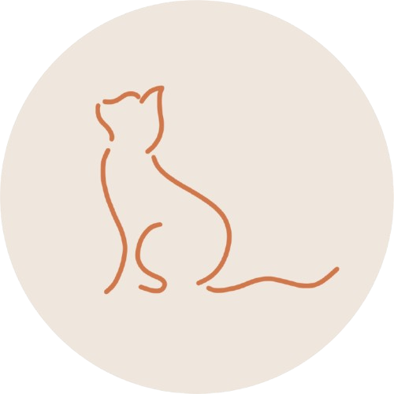

# ✦ MSAMG DIGITAL PORTFOLIO ✦

### GE 4120: 21st Century IT Skills

*Welcome to my digital portfolio!*

This repository showcases my activities and outputs completed during the **Prelim Period** for GE 4120: *21st Century IT Skills*.

 

---

## ✦ PORTFOLIO OVERVIEW ✦

This digital portfolio documents my learning journey through activities involving:

🎨 **Presentation Design Principles**

🖋️ **Color Palette & Typography**

📊 **Social Media Infographics & Mini Project Documentation**

---

 

# 🌷 ACTIVITY 1

### Presentation Design Principles

 

 

### ✦ About This Activity

This activity focuses on the application of presentation design principles to create a visually organized and engaging presentation.

### 💭 My Work

**Arrupe Hall**

<!-- ADD YOUR EXPLANATION HERE -->

In this activity, I created ________________________________________________.

The concept behind my work was __________________________________________.

I applied design principles such as _______________________________________.

These design choices helped improve _______________________________________.

 

---

 

# 🎨 ACTIVITY 2

   

   

 

### ✦ About This Activity

**Amor Closet**

<!-- ADD YOUR EXPLANATION HERE -->

This activity explores the importance of color palettes and typography in creating a visually appealing design.

### 🎨 Color Palette

The colors I selected were _______________________________________________.

I chose these colors because _____________________________________________.

### 🖋️ Typography

The typography I selected was ____________________________________________.

I chose these fonts because ______________________________________________.

### 💭 Design Concept

The overall concept of my design was ______________________________________.

 

---

 

# 📊 ACTIVITY 3

### Social Media Infographics & Mini Project Documentation

 

 

### ✦ About This Activity

**Financial Blind Spots**

<!-- ADD YOUR EXPLANATION HERE -->

For this activity, I created an infographic that focuses on __________________.

### 💡 Concept

The main concept behind my infographic was ________________________________.

### 🎨 Design Choices

I selected the colors, typography, and visual elements because ______________.

### 🛠️ Creative Process

I developed my final output by ___________________________________________.

 

---

 

# 🌱 MY LEARNING JOURNEY

Through these activities, I learned how effective presentation design can improve the way ideas and information are communicated.

I learned that the proper use of **design principles, color palettes, typography, and visual organization** can make information easier to understand, more engaging, and visually meaningful.

 

---

### ✦ Thank you for visiting my digital portfolio! ✦

